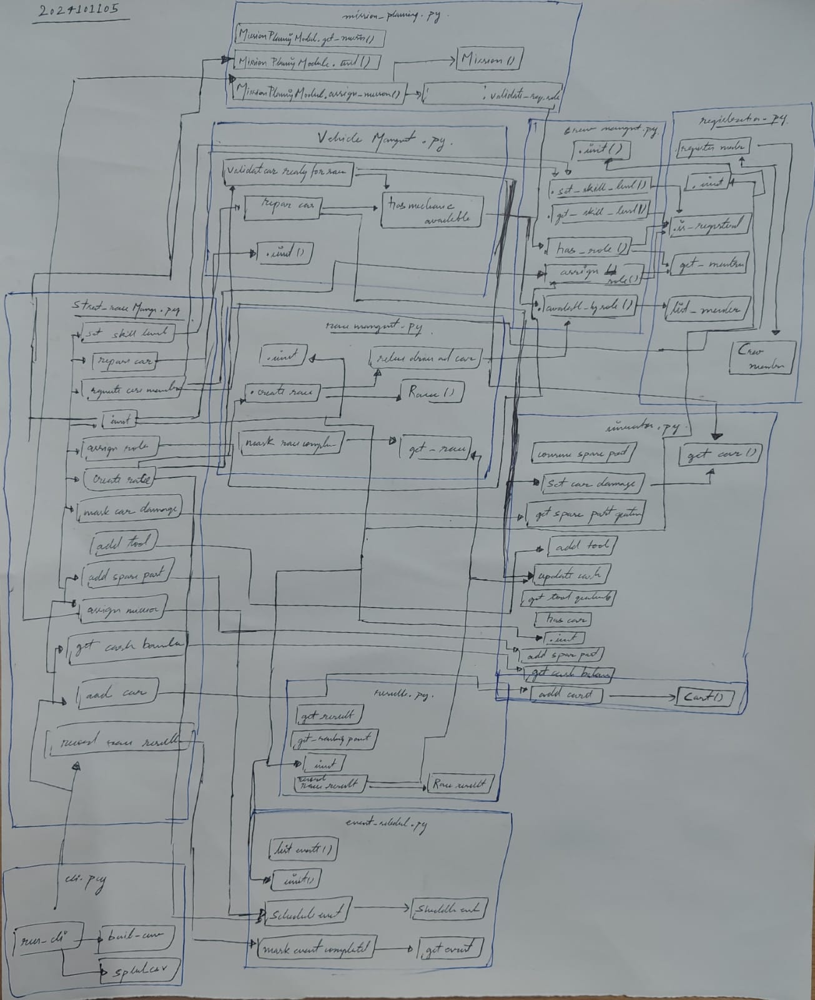

# StreetRace Manager - Integration Report

## 1. Project Overview
StreetRace Manager is a modular command-line system for managing a street-racing team.

The system supports:
- Crew registration and role management
- Car, tool, spare-part, and cash inventory management
- Race creation and participation validation
- Race result processing and ranking updates
- Mission assignment with role validation
- Vehicle repair management
- Event scheduling for races and missions

The implementation follows modular integration where each module has a focused responsibility and all modules are connected through an orchestration layer (`StreetRaceManager`).

## 2. Module Descriptions (Core + Extra)

### 2.1 Registration Module (`registration.py`) [Core]
- What it does: Stores and retrieves crew members.
- How it works:
  - `register_member(name, role=None)` normalizes and validates input before adding a member.
  - `is_registered(name)` checks membership.
  - `get_member(name)` returns member details or raises an error if not registered.
- Business rules enforced:
  - Crew name cannot be empty.
  - Duplicate crew registration is not allowed.
- How it interacts:
  - Crew Management depends on it before role and skill operations.
  - Any workflow that touches a member starts from this module.

### 2.2 Crew Management Module (`crew_management.py`) [Core]
- What it does: Assigns roles and tracks skill levels.
- How it works:
  - `assign_role(name, role)` validates registration and allowed role.
  - `set_skill_level(name, level)` validates registration and non-negative skill.
  - `has_role(name, role)` and `available_by_role(role)` provide role lookup for integration logic.
- Business rules enforced:
  - Role assignment must fail if crew is not registered.
  - Allowed roles are only: `driver`, `mechanic`, `strategist`.
  - Skill level must be non-negative.
- How it interacts:
  - Race Management checks `driver` role before race entry.
  - Mission Planning checks required roles.
  - Vehicle Maintenance checks mechanic availability.

### 2.3 Inventory Module (`inventory.py`) [Core]
- What it does: Manages cars, tools, spare parts, and cash balance.
- How it works:
  - Car APIs: `add_car`, `has_car`, `get_car`, `set_car_damage`.
  - Resource APIs: `add_tool`, `add_spare_part`, `consume_spare_part`, quantity getters.
  - Finance APIs: `update_cash`, `get_cash_balance`.
- Business rules enforced:
  - IDs/names cannot be empty.
  - Duplicates are blocked where applicable.
  - Quantities are validated (no invalid negative/zero actions).
- How it interacts:
  - Race Management validates car existence and damage state.
  - Results updates cash after race completion.
  - Vehicle Maintenance consumes parts, clears damage, and deducts repair cost.

### 2.4 Race Management Module (`race_management.py`) [Core]
- What it does: Creates races and tracks race status.
- How it works:
  - `select_driver_and_car(driver_name, car_id)` validates role and car readiness preconditions.
  - `create_race(race_id, driver_name, car_id)` creates a unique race after validation.
  - `mark_race_completed(race_id)` updates race state.
- Business rules enforced:
  - Only drivers can enter races.
  - Selected car must exist in inventory.
  - Damaged car requires mechanic availability.
- How it interacts:
  - Pulls role data from Crew Management.
  - Pulls car data from Inventory.
  - Results module transitions race state to completed.

### 2.5 Results Module (`results.py`) [Core]
- What it does: Records race outcomes, updates rankings, and updates cash.
- How it works:
  - `record_race_result(race_id, finishing_order, prize_cash)` validates input, awards points by position, updates inventory cash, and marks race completed.
  - `get_ranking_points(driver_name)` returns ranking score.
  - `get_result(race_id)` fetches stored race results.
- Business rules enforced:
  - Finishing order cannot be empty.
  - Same race cannot be recorded twice.
  - Race completion must propagate to financial updates.
- How it interacts:
  - Reads race state from Race Management.
  - Writes cash changes to Inventory.

### 2.6 Mission Planning Module (`mission_planning.py`) [Core]
- What it does: Assigns missions after required role validation.
- How it works:
  - `validate_required_roles(required_roles, assigned_crew)` ensures mission staffing rules are met.
  - `assign_mission(mission_id, required_roles, assigned_crew)` stores mission after checks.
- Business rules enforced:
  - Mission ID is required.
  - Required roles list cannot be empty.
  - Assigned crew list cannot be empty.
  - All required roles must be available in assigned crew.
- How it interacts:
  - Uses Crew Management as the source of role truth.

### 2.7 Vehicle Maintenance Module (`vehicle_maintenance.py`) [Extra Module 1]
- What it does: Handles damaged-car validation and repairs.
- How it works:
  - `has_mechanic_available()` checks mechanic presence.
  - `validate_car_ready_for_race(car_id)` blocks race-readiness for damaged cars without mechanics.
  - `repair_car(...)` consumes spare parts, clears damage status, and deducts repair cost.
- Business rules enforced:
  - Repair requires mechanic availability.
  - Repair requires damaged-car condition.
- How it interacts:
  - Uses Crew Management for mechanic checks.
  - Uses Inventory for car state, spare parts, and cash updates.

### 2.8 Event Scheduler Module (`event_scheduler.py`) [Extra Module 2]
- What it does: Schedules race/mission events and tracks completion status.
- How it works:
  - `schedule_event(event_id, event_type, reference_id, timestamp)` validates and stores event.
  - `mark_event_completed(event_id)` marks scheduled event done.
  - `get_event` and `list_events` provide event lookup/listing.
- Business rules enforced:
  - Event type must be `race` or `mission`.
  - Event ID, reference ID, and timestamp are mandatory.
  - Duplicate event IDs are rejected.
- How it interacts:
  - StreetRaceManager creates/updates events during race and mission lifecycles.

### 2.9 Integration Layer (`streetrace_manager.py`) and CLI (`cli.py`)
- `StreetRaceManager` integrates all modules and coordinates cross-module data flow.
- `cli.py` exposes command-style operations and maps user commands to manager methods.

## 3. Business Rules and Interaction Flow

### 3.1 Rules implemented
- Crew must be registered before assigning roles.
- Role assignment fails for unregistered members.
- Only drivers can enter races.
- Race creation validates selected drivers and car existence.
- Damaged car requires mechanic availability.
- Race results update inventory cash.
- Missions require required roles to be available.

### 3.2 Cross-module interaction flow
- Registration -> Crew Management
- Crew + Inventory -> Race Management
- Race -> Results -> Inventory
- Crew -> Mission Planning
- Crew + Inventory -> Vehicle Maintenance -> Race
- Race/Mission -> Event Scheduler

### 3.3 Data flow summary
- Member data (name/role/skill) drives race and mission validation.
- Car condition (`is_damaged`) drives maintenance/race readiness decisions.
- Cash changes are centralized through Inventory updates.

## 4. Detailed Integration Test Cases (All 31 Cases)

## 4.1 Test execution and current result
Commands used:

```bash
/tmp/streetrace-venv/bin/python -m coverage erase
/tmp/streetrace-venv/bin/python -m coverage run --branch --source=rollnumber/integration/code -m pytest rollnumber/integration/tests -q
/tmp/streetrace-venv/bin/python -m coverage report -m
```

Actual outcome:
- `31 passed`
- `100% statement coverage`
- `100% branch coverage`

### 4.2 End-to-end workflow tests (`test_integration_workflows.py`)

1. `test_register_driver_then_enter_race_success`
- Scenario: Register `Ava` as driver, add `CAR-101`, create race.
- Modules: Registration, Crew, Inventory, Race.
- Expected: race created with correct driver and car.
- Actual: Passed.
- Why needed: Verifies the most basic real workflow succeeds.

2. `test_enter_race_without_driver_role_fails`
- Scenario: Register non-driver role and try race entry.
- Modules: Registration, Crew, Inventory, Race.
- Expected: race creation fails.
- Actual: Passed.
- Why needed: Prevents unauthorized race participation.

3. `test_complete_race_updates_results_rankings_and_inventory_cash`
- Scenario: Create race, record finishing order, award prize.
- Modules: Race, Results, Inventory.
- Expected: race completed + points updated + cash increased.
- Actual: Passed.
- Why needed: Validates critical financial and ranking propagation.

4. `test_assign_mission_validates_roles_success_and_failure`
- Scenario: Mission with valid roles (pass) and missing role (fail).
- Modules: Crew, Mission.
- Expected: first assignment succeeds, second fails.
- Actual: Passed.
- Why needed: Confirms strict role checks for mission safety.

5. `test_damaged_car_requires_mechanic_availability`
- Scenario: Damaged car race attempt before and after mechanic registration.
- Modules: Crew, Inventory, Maintenance, Race.
- Expected: fail without mechanic, pass with mechanic.
- Actual: Passed.
- Why needed: Enforces damaged-car business rule in integrated flow.

6. `test_role_assignment_fails_for_unregistered_member`
- Scenario: assign role to unknown member.
- Modules: Registration, Crew.
- Expected: validation error.
- Actual: Passed.
- Why needed: Protects consistency of crew state.

### 4.3 Module-edge and validation tests (`test_edge_cases_and_coverage.py`)

7. `test_registration_module_rejects_invalid_and_duplicate_entries`
- Scenario: empty name, duplicate register, unknown member fetch.
- Modules: Registration.
- Expected: all invalid actions fail with clear errors.
- Actual: Passed.
- Why needed: Avoids bad identity data and duplicate users.

8. `test_crew_management_validations_and_skill_queries`
- Scenario: invalid role, invalid skill assignment, unknown member checks.
- Modules: Registration, Crew.
- Expected: validation errors on invalid inputs, default skill query works.
- Actual: Passed.
- Why needed: Ensures crew rules are enforced in all corner paths.

9. `test_inventory_module_edge_cases_and_state_mutations`
- Scenario: invalid car/tool/part inputs, part consumption errors, cash updates.
- Modules: Inventory.
- Expected: invalid operations fail, valid state mutations succeed.
- Actual: Passed.
- Why needed: Inventory is shared by multiple modules; corruption here affects the whole system.

10. `test_race_management_validation_errors_and_lookup_paths`
- Scenario: empty race ID, missing car, damaged car without mechanic, duplicate race, unknown race lookup.
- Modules: Crew, Inventory, Race.
- Expected: all invalid branches fail; valid case succeeds.
- Actual: Passed.
- Why needed: Covers all major race creation and retrieval failure branches.

11. `test_results_module_duplicate_empty_and_missing_result_cases`
- Scenario: empty finishing order, duplicate result submission, unknown result lookup.
- Modules: Race, Results, Inventory.
- Expected: errors for invalid cases; valid points distribution works.
- Actual: Passed.
- Why needed: Prevents duplicate payouts and invalid standings.

12. `test_mission_planning_validation_and_lookup_edges`
- Scenario: empty roles, empty assigned crew, empty mission ID, duplicate mission, unknown mission.
- Modules: Crew, Mission.
- Expected: invalid mission data rejected.
- Actual: Passed.
- Why needed: Prevents incomplete or conflicting mission assignments.

13. `test_vehicle_maintenance_repair_paths_and_side_effects`
- Scenario: repair without mechanic, repair on healthy car, successful repair with parts and cost.
- Modules: Crew, Inventory, Maintenance.
- Expected: invalid repairs fail; successful repair updates car state, parts, and cash.
- Actual: Passed.
- Why needed: Confirms maintenance side-effects are consistent and safe.

14. `test_event_scheduler_validations_listing_and_completion`
- Scenario: invalid scheduler inputs, duplicate events, list filtering, event completion.
- Modules: Event Scheduler.
- Expected: invalid events rejected; valid events tracked correctly.
- Actual: Passed.
- Why needed: Ensures timeline/event tracking remains trustworthy.

### 4.4 Integration-orchestrator tests (`test_edge_cases_and_coverage.py`)

15. `test_streetrace_manager_wrapper_methods_and_scheduling_branches`
- Scenario: full manager-level workflow using wrappers for crew, repair, race scheduling, result recording, mission scheduling.
- Modules: All major modules via StreetRaceManager.
- Expected: event scheduling and cash behavior remain consistent across chained operations.
- Actual: Passed.
- Why needed: Verifies that module integration is correct, not only isolated module behavior.

16. `test_streetrace_manager_register_member_with_default_optional_values`
- Scenario: register crew with default role and skill parameters.
- Modules: StreetRaceManager, Registration, Crew.
- Expected: member created with role `None` and default skill `0`.
- Actual: Passed.
- Why needed: Covers optional/default parameter branches used in real CLI usage.

### 4.5 CLI tests (`test_edge_cases_and_coverage.py`)

17. `test_split_csv_handles_whitespace_and_empty_values`
- Scenario: CSV with extra spaces/empty elements.
- Modules: CLI helper.
- Expected: clean normalized list output.
- Actual: Passed.
- Why needed: Prevents user-input formatting issues from breaking commands.

18 to 28. `test_cli_run_command_success_paths` (11 parameterized command cases)
- Scenario: run each supported command with a fake manager and verify expected output.
- Modules: CLI + manager interface.
- Expected: each command returns exit code `0` and prints expected line.
- Actual: Passed (11/11).
- Why needed: Ensures every public CLI command path is actually usable.

18. `register --name Ava --role driver --skill 9`
19. `assign-role --name Ava --role driver`
20. `set-skill --name Ava --level 8`
21. `add-car --car-id CAR-CLI --damaged`
22. `add-spare-part --part repair_kit --quantity 3`
23. `damage-car --car-id CAR-CLI`
24. `repair-car --car-id CAR-CLI --part repair_kit --quantity 1 --cost 150`
25. `create-race --race-id RACE-CLI --driver Ava --car CAR-CLI --schedule ...`
26. `record-result --race-id RACE-CLI --order Ava,Noah --prize 500`
27. `assign-mission --mission-id MISSION-CLI --required-roles ... --assigned-crew ... --schedule ...`
28. `cash-balance`

29. `test_cli_returns_error_code_on_value_error`
- Scenario: manager raises `ValueError` inside CLI command.
- Modules: CLI error handling.
- Expected: CLI prints `Error: ...` and returns exit code `1`.
- Actual: Passed.
- Why needed: Verifies robust failure behavior for users.

30. `test_cli_unknown_command_falls_through_to_success`
- Scenario: parser returns unknown command path through mocked parser.
- Modules: CLI control flow.
- Expected: no crash; returns `0` with no output.
- Actual: Passed.
- Why needed: Covers fallback branch and prevents unhandled-command crashes in mocked/edge parser conditions.

31. `test_cli_main_entrypoint_executes_with_system_exit`
- Scenario: run module as `__main__` using `runpy` and mocked `sys.argv`.
- Modules: CLI module entrypoint.
- Expected: `SystemExit(0)` and cash-balance output.
- Actual: Passed.
- Why needed: Ensures real command-line invocation path works correctly.

## 5. Errors Detected and Fixed

### 5.1 Errors detected
- No functional business-logic defect was found in latest integration run.

### 5.2 Issues found during testing quality checks
1. Coverage gaps existed in earlier runs (missing branches in CLI and manager paths).
- Detection: Coverage report with branch mode.
- Fix: Added targeted edge/branch tests in `test_edge_cases_and_coverage.py`.

2. Warning-prone behavior in CLI main-entry test setup.
- Detection: Runtime warning possibility when executing `runpy.run_module("code.cli", run_name="__main__")` with module state already loaded.
- Fix: Test now safely handles `sys.modules` around the runpy call.

### 5.3 Final quality status after fixes
- All tests pass.
- Integration code has 100% statement and branch coverage.
- No pending known functional defects in integration scope.

## 6. System Integration Summary

### 6.1 How modules work together
- Registration ensures identity validity.
- Crew module adds capability (roles/skills).
- Inventory provides resources and financial state.
- Race and Mission modules enforce role/resource preconditions.
- Results and Maintenance produce state transitions and cash impact.
- Scheduler tracks timing lifecycle for race/mission operations.
- StreetRaceManager orchestrates these operations as a cohesive system.

### 6.2 Call relationships (mapped to call graph)
Diagram file:
- `diagrams/Diagram3.jpeg`



Key call chains:
- `run_cli()` -> StreetRaceManager methods
- `create_race()` -> `validate_car_ready_for_race()` -> `create_race()`
- `record_race_result()` -> `record_race_result()` -> `mark_race_completed()` + `update_cash()`
- `assign_mission()` -> `validate_required_roles()`
- `repair_car()` -> `consume_spare_part()` + `set_car_damage()` + `update_cash()`

## 7. Latest verified result
Command used:

```bash
/tmp/streetrace-venv/bin/python -m coverage erase
/tmp/streetrace-venv/bin/python -m coverage run --branch --source=rollnumber/integration/code -m pytest rollnumber/integration/tests -q
/tmp/streetrace-venv/bin/python -m coverage report -m
```

Actual outcome:
- `31 passed`
- `TOTAL ... Cover 100%`
- Branch coverage: `122 branches, 0 partial`
